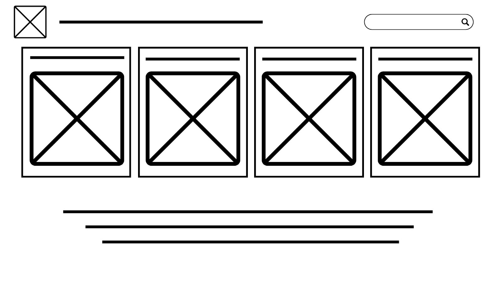
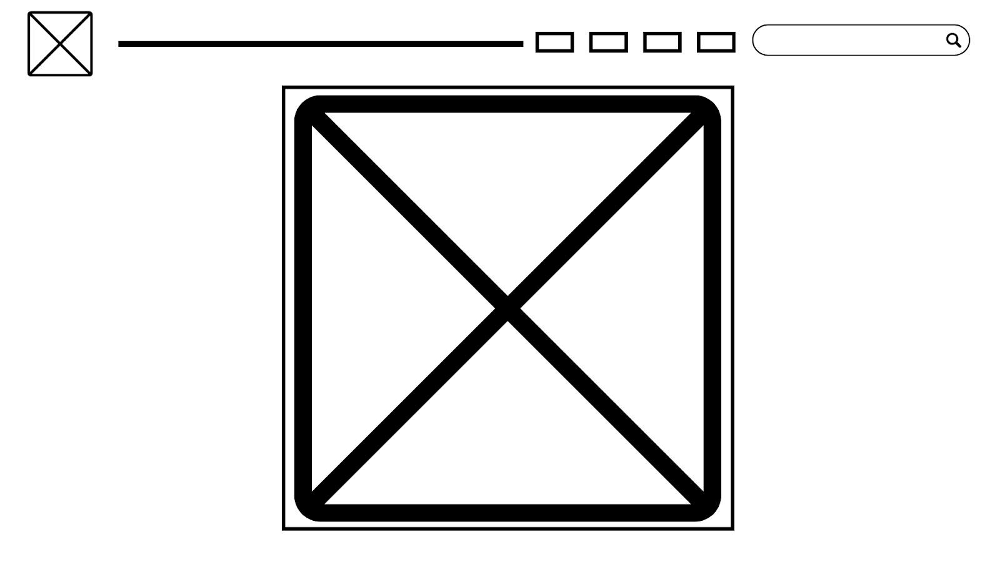
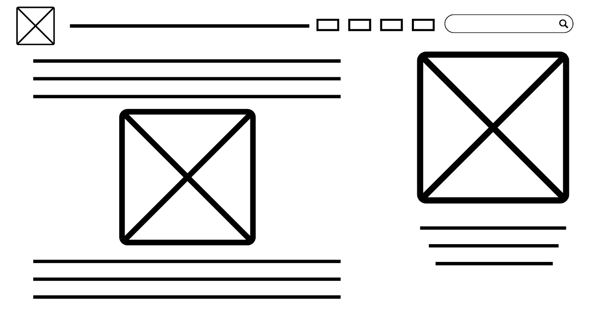

# <ins>**Task 1- UX Design**<ins>
---
## <ins>**Project Proposal**<ins>
### **1. Design Brief**
The project that I aim to create will be based on the book Murtagh by Christopher Paolini, a book that occurs after the original Eragon/ Inheritance Cycle series. The project will be designing an interactive website in which users can use to find descriptions, lore, maps and information about the characters, locations and background of the book. The target audience would be people that just need a bit more understanding of the large variety of characters and locations, or just picking up the book and needing a refresher on the events that happened in the original series.

---
### **2. Book Choice and Justification**
The book, Murtagh by Christopher Paolini,  is a fantasy, similar to the style The Lord of the Rings written by JRR Tolkien. Set in the world of Alagaësia with Elves living in the woodland region named Du Weldenvarden to the north, Urgals (Orcs) living in the mountain range named The Spine that covers the west coast and Dwarves that reside in the Beor mountains which reaches above the range that the eyes can see. 
#### **Blurb**
In a world fraught with danger, Dragon Rider Murtagh and his dragon, Thorn, face the consequences of their reluctant role in the reign of a toppled evil king. Now outcast and despised, they navigate the fringes of society. As whispers of looming danger and faint traces of brimstone invade the air, Murtagh senses a sinister force in Alagaësia's shadows. Embarking on an epic journey through both familiar and unexplored lands, Murtagh and Thorn must use all their wit and strength to confront a mysterious witch who is much more than she appears. In this compelling tale from Christopher Paolini's Inheritance Cycle, Murtagh seeks to uncover his true identity in a world that has abandoned him. Murtagh is an enthralling adventure for both new and returning fans of the World of Eragon.
#### **Justification**
I have chosen this book as it has vast amount of lore, backgrounds and information that can be explored if someone has forgotten. I also think that this series of books is really good and actually enjoyable to read, therefore making me actually reading it and not just read a few chapters and leave it. This type of book also would be perfect for a wiki because of it’s large universe.
___________________________________________________________________
### **3. User Experience Type**
The format of this project will be in a website format as this makes the most sense, you could access it from any device connected to the internet (if this ever goes public). In this format it will enhance the usability of the project as the information and images would be easy to access and more efficient in allowing the user to find the thing they desire.
_________________________________________________________________________
### **4. Target Market**
The target audience for this project will be people who enjoy books like Lord of the Rings, so a wide range of age groups would be interested in this book and would therefore possibly be using this project. If they do decide to use this project to aid themselves with understanding more of the lore and background behind the events and book in general. A website would also cater to most of the audience as the most you’d need would be the access to a browser and the internet to go onto the website and collect the necessary information.
_________________________________________________________________________
### **5. Software and Tools**
The software platform that i’ll be using will be AdobeXD as this  is one the easier tools to use and I somewhat know how to use it. AdobeXD would be perfect as this would allow me to visualise how it would look as well as how it’ll function when finished. 
_________________________________________________________________________
### **6. Initial Brainstorming**

The key themes that this project will be surrounded on will be based on efficiently displaying information, with design elements that simplify navigation and makes it look pretty. The design of this should make the website look visually appealing, and make it easy to navigate and process for the human eye and brain.

---
---
## <ins>**Requirements Specification**<ins>
### **Functional Requirements**
- #### **Purpose of the Applicaiton**
The website will aim to provide useful information on the backgrounds of individuals and locations in the found throughtout the book, helping returning enthusiasts or new people of the series to gain a deeper understandig on the book and lore. The app is designed to engage fans that are reading the book or new fans that are interested in this genre

- #### **Use Cases**
**1.** Users can select a location to learn the story\
**2.** Users can select a character to learn their backstory\
**3.** Users can select an event to learn of the causes and outcomes\
**4.** Users can select the map to gain a better picture of the land

**a)** Location will be in the starting menu and then they can chose the specific location they want to look into\
**b)** Characters will also be on the starting menu and then the user choses which character they would like to learn about in that section\
**c)** Events will be another tab on the main menu with individual events in it's own section when you press this button\
**d)** Map will be the final button on the main menu and when pressed will come up with map of the world

- #### **Test Cases**
**1.** User will click on the locations tab. Webstie will move onto that tab and then display a list of locations. User will click on one of these prompting for the website to switch to that page, showing a detailed description on that lovation.\
**2.** User will click on the characters tab. Website will move onto that tab and then display a list of characters with names. User will click on one of these prompting for the website to switch to that page, showing a detailed description on that character.\
**3.** User will click on the events tab. Website will move onto that tab and then display a list of events. User will click on one of these prompting for the website to switch to that page, showing a detailed description on that event.\
**4.** User will cllick on the map tab. Website will move onto that tab and then display a map for the user to look at.

---
### **Non-Functional Requirements**
- #### **Performance**
The ideal outcome of performance for the website will be that it has barely any to none input delay and loading times unless it's a page with a heavy amount of images. For example if you're going from the main page to a character description page it might take a bit to load if it is heavy on images
- #### **Usability**
The app will have a clean and easy to navigate design, peeling away from the typical wiki designs that you find online that have ugly boxes everywhere. The themes will be white/black with accents of red making it look more visaully appealling.
- #### **Reliability**
The app will be tested rigorously with me testing each section multiple times to see that it will function correctly and Figma should work across different screen sizes.
- #### **Security**
The app will not collect any user data so there will be no risk in security breaches and leaking private user information.

---
---
## <ins>**Social, Ethical and Legal Issues**<ins>
### **Social Impact**
- #### **Target Audience Considerations**
The target audience for this porject will be new people to the book or returning enthusiasts of the previous series "The Inheritance Cycle", this experience will not cater people with  disabilities such as blindness, and should be accesible to most people. It will not be in other languages, only english, I mean if you're reading a book written in english you shouldn't have a problem with this site.

- #### **Potential Benefits**
This will positively impact users by encouraging them to read more and will also provide a talking topic when communicating to someone else that has read the book. This will make the book more enjoyable by providing you with more information so that you can understand the situation, characters and plot better.

- #### **Potential Benefits**
The design shouldn't be excluding or misrepresenting certain groups, and there shouldn't be any themes in the site or book that are sensitive and upsetting to users. Since this is a fantasy world and written like Lord of the Rings which had massive success, the themes shouldn't be offending anyone.

---
### **Ethical Responsibilities**
- #### **User Data & Privacy**
The prototype will not collect user data so there will be nothing to leak in case of a data breach.

- #### **Representation & Inclusion**
The project does fairly represent characters, themes and ideas from the book as all the characters are somewhat likeable except the villains but i will treat them fairly.

- #### **Content Sensitivity**
The book does have some violence in it, in the form of battles and fights, but not over the top, and the prototype for this site will try to avoid expressing these topics of violence.

---
### **Legal Considerations**
- #### **Copyright & Intellectual Property**
There will be one image taken from the book of the map and layout of the land. The text on the character, locations and events, I will try to write as much of it as i can myself, if i do have to take some parts form another wiki, I will create a reference list with sources.

- #### **Terms of Use**
The terms of use of this project will make it so that it won't just be copying the whole book, the summaries will be mostly created by myself and as this website won't be collecting any user data they wouldn't need to agree to any terms and conditions or cookies as there is no advertising either. It will also clearly state that this is a fan project and not the actual author of the book

---
---
## <ins>**Researching and Planning**
### **Gantt Chart**
.png "Gantt Chart") 

---
### **Researching Existing UIs**
| UI Name | Plus | Minus | Implication |
| :---- | :---- | :---- | :---- |
| Wikipedia | The wikipedia ui is simple to use and navigate, built for housing large pages of information, sources and images. This makes it a very efficient in displaying information when being used for researching | The UI for this website is not that all visually appealing  with it just being bland and colourless | Will integrate the design and the features of it having the blue text which brings you into a more detailed page on the highlighted section. This would work well as it supports the large sections of text better and enhances the user understanding experience |
| f1.com | This website has a great design overall with a red and white theme, it displays information incredibly well with each article having a picture that will somewhat describe what is happening. The articles are well formatted with text and then many images throughout. | Very very heavy on images and doesn’t display large amounts of text and information as well as wikipedia which it is made for. | I will be integrating the design and the layout as well as its great support of images. This website makes me more conscious of the number of images as if there are too many it won’t look as good. |
| Gitbook | This website’s design is very easy to navigate and has a sort of timeline feature as in it gives you an order in which sections you are supposed to do after another.  | It is like wikipedia where it is not very colourful but the overall design and placement aren’t as bad.  | This UI is great for putting sections in the right order which will be great for parts of my such as the events tab  |

---
### **Research Software Options**
| Software | Plus | Minus | Implication |
| :---- | :---- | :---- | :---- |
| Figma | UI seems simple enough to learn and the software is also cloud based which means I can easily access it anywhere | You have to pay for a lot of features.  | I think that the positives outway the negatives, it’s not as if the entire software is locked behind a pay wall. Even if i do need a specific feature i should be able to find a workaround. |
| Adobe XD | The main thing is that it is made by adobe, which means that if i was to use photoshop or any other branches of their company, it would be easy to integrate. | Apparently hard to learn according to the internet so that will probably slow development speed down | I don’t think I will be using this software as it’s harder to learn than figma and i don’t think i would be relying on the creative cloud stuff too much |
| Google Sites | Completely free software made by google, and is very simple to use. This software is also cloud based allowing you to access it easily and efficiently from anywhere. | There are limited design options as well as limited customisation to how the site works. | Also don’t think I will be using this site as it doesn’t allow for heavy customisation and there is limited design options which is something that i would very much like |

---
### **Wireframes**
**Main Page**

**Map Page**

**Character Page**

---
## <ins>**Testing and Evaluating**
### **User Testing & Feedback**

---
### **Ongoing Evaluations**

---
### **Final Evaluation**

---
---